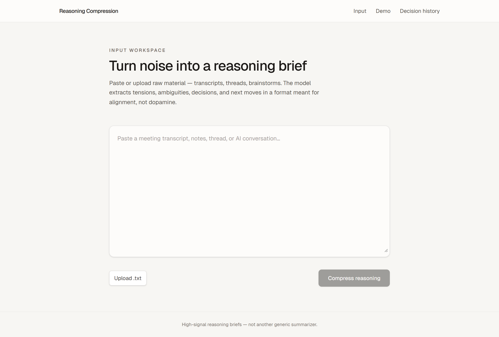
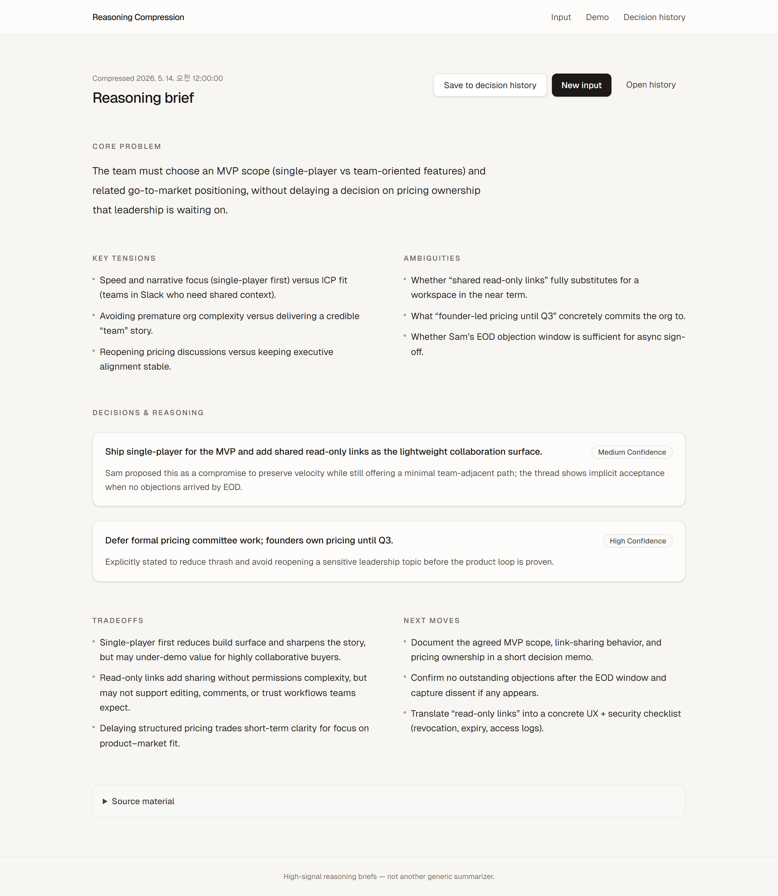
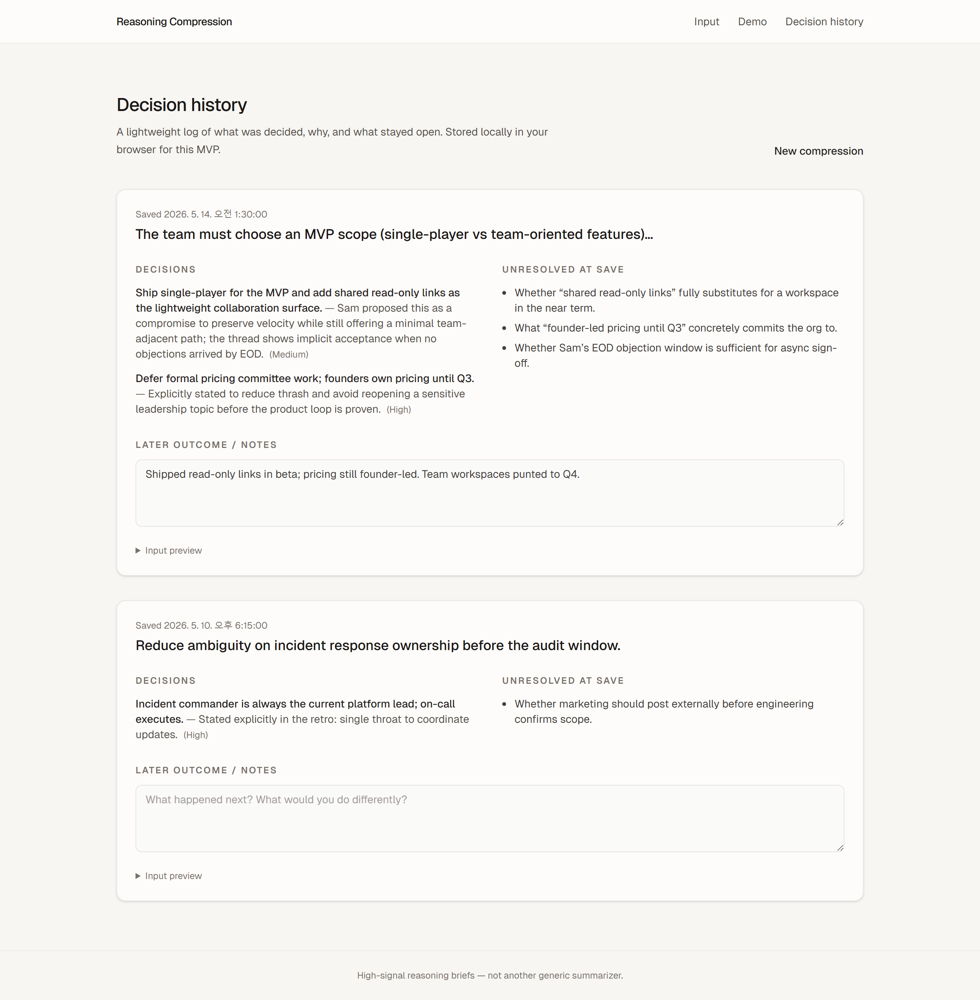

# Reasoning Compression OS (MVP)

A minimal Next.js app that turns long-form text into a structured reasoning brief: core problem, tensions, ambiguities, decisions (with reasoning), tradeoffs, and next moves.

## Product screenshots

### 1. Input workspace

Paste or upload raw material, then run **Compress reasoning** (requires `OPENAI_API_KEY` in `.env.local`).



### 2. Reasoning brief

Structured brief: core problem, tensions, ambiguities, decisions with reasoning, tradeoffs, and next moves. Static sample at **`/demo`** (no API key).



### 3. Decision history

Log of saved briefs with outcomes and unresolved items. Static sample at **`/history/demo`** (no API key); live data uses browser `localStorage` on **`/history`**.



## Setup

```bash
npm install
cp .env.example .env.local
# add OPENAI_API_KEY
npm run dev
```

Open [http://localhost:3000](http://localhost:3000).

## Screenshots

Regenerate all images in `docs/`:

```bash
npm run capture:readme
```

Requires a one-time Playwright browser install: `npx playwright install chromium`.

## Deploy

Works on [Vercel](https://vercel.com): set `OPENAI_API_KEY` in project environment variables.

Decision history is stored in `localStorage` in this MVP (no database).

## Stack

Next.js (App Router), Tailwind CSS v4, OpenAI Chat Completions with JSON mode.
